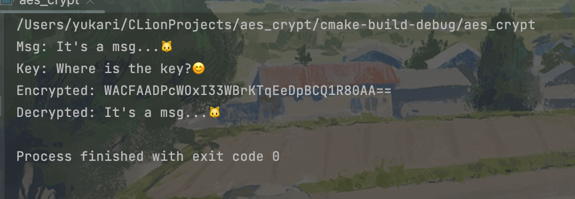

# AES-implementation-in-cpp
## Description
#### This is a simple implementation of AES algorithm in C++.
#### The algorithm is the same as AES.Class.php
#### [aes.class.php](https://gist.github.com/chrisns/3992815#file-aes-class-php)

## Usage
### Compile
```bash
cmake .
make
```
### Run
```bash
./aes_crypt
```

